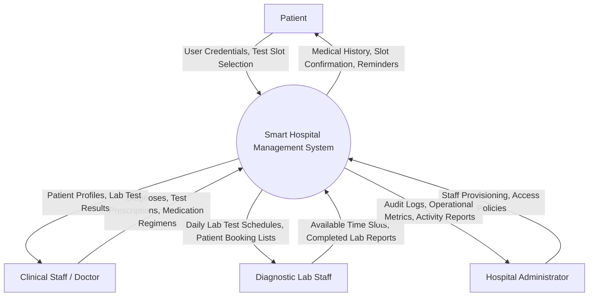
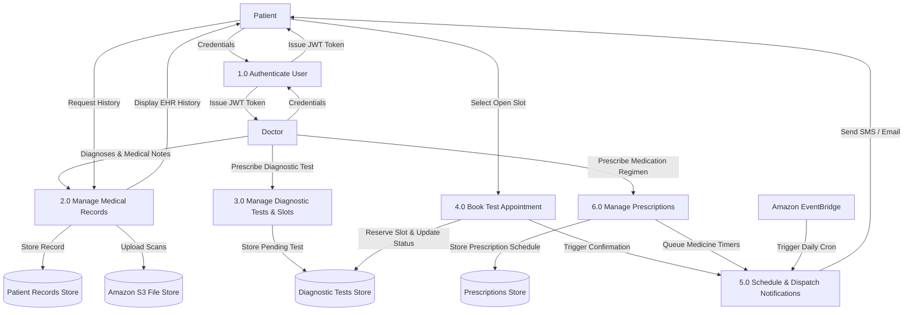
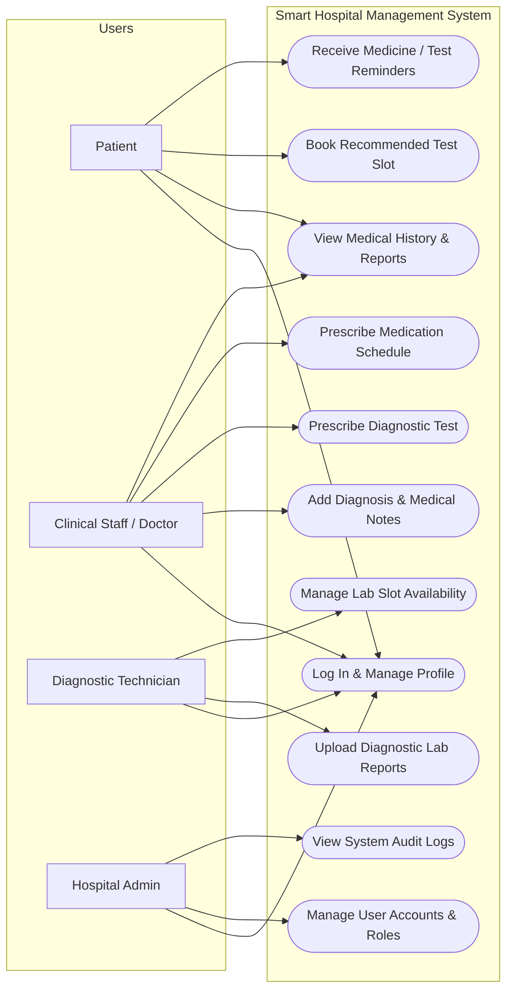
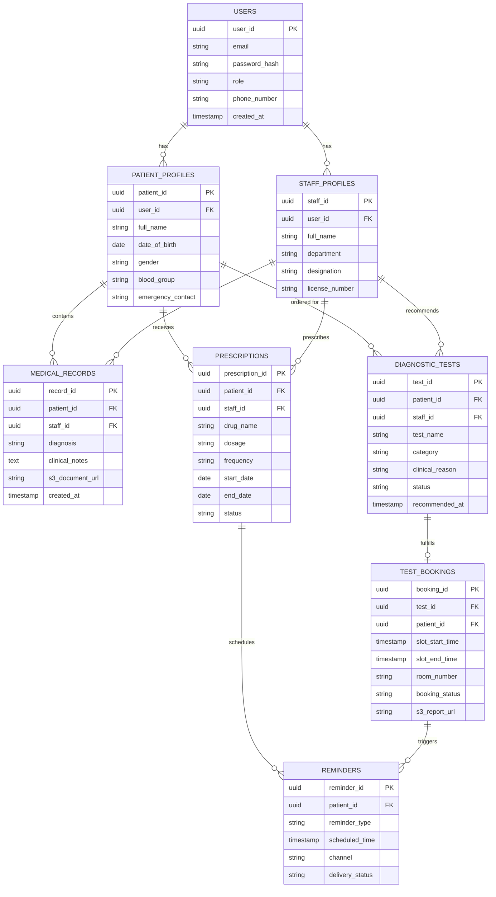

# EXPERIMENT 4

**Course Title**: Software Design Principles (SDP)  
**Selected Project**: Smart Hospital Management System  
**Document**: Software Requirements Specification (SRS)  
**Team Members**: 4 Collaborators (Team Project)  
**Author / Contributor**: rajan-2101 (`rajan.2428it1539@kiet.edu`)  

---

## Aim
To understand the structure, significance, and quality attributes of a Software Requirements Specification (SRS) and to prepare a comprehensive, industry-standard SRS document for the **Smart Hospital Management System** adhering to the IEEE 830 / Karl E. Wiegers standard template.

---

## Objectives
1. Understand what a Software Requirements Specification (SRS) is and examine its significance in software development.
2. Study the key characteristics of a high-quality SRS document (Correctness, Completeness, Consistency, Unambiguity, Verifiability, Modifiability, Traceability, etc.).
3. Transform elicited stakeholder needs, functional requirements (FR1–FR10), and non-functional requirements (NFR1–NFR9) from Experiment 3 into a formal SRS document.
4. Define external interface requirements including UI, hardware, software, and communication interfaces for a cloud-native architecture (AWS).
5. Specify detailed system features with priority ratings, stimulus/response sequences, and tagged functional requirements (`REQ-x`).
6. Model analysis diagrams (Use Case Diagram, Context Level 0 DFD, Level 1 DFD, and Entity Relationship Diagram) to prevent ambiguity.

---

## Background & Theoretical Framework

### 1. What is a Software Requirement Specification (SRS)?
A Software Requirements Specification (SRS) is an authoritative document that describes the intended purpose, behavior, features, and constraints of a software system. It establishes a formal contract between stakeholders, clients, system architects, software engineers, and quality assurance teams.

### 2. Significance of SRS
* **Accurately Defining System Requirements**: Details functional capabilities, performance expectations, constraints, and business logic to ensure client requirements are met.
* **Reference Point Across SDLC**: Serves as the single source of truth during development, verification, code reviews, and validation testing.
* **Facilitating Team Communication**: Provides an unambiguous, shared vocabulary across cross-functional team members (patients, doctors, administrators, developers, testers).
* **Cost-Effective Development**: Enables early detection of defects, omissions, and contradictions, preventing expensive rework during later phases of the development cycle.

### 3. Characteristics of a Good SRS Document
According to IEEE Std 830 and Wiegers' framework:
1. **Correctness**: Every requirement stated reflects actual stakeholder expectations and clinical workflows.
2. **Completeness**: Encompasses all functional and non-functional requirements, error handling, constraints, and page numbering.
3. **Consistency**: Terminologies, acronyms, and logical rules do not conflict with each other.
4. **Unambiguousness**: Every requirement statement has exactly one interpretation, supported by structured analysis models.
5. **Ranking for Importance and Stability**: Requirements are ranked by priority (High, Medium, Low) and relative stability.
6. **Modifiability**: Structured modularly with standardized tagging (`REQ-x`) to facilitate change tracking and cross-referencing.
7. **Verifiability**: Stated quantifiably and objectively so that automated or manual test cases can verify compliance.
8. **Traceability**: Forward and backward traceability exists from stakeholder needs $\rightarrow$ requirements $\rightarrow$ design components $\rightarrow$ code $\rightarrow$ test cases.
9. **Design Independence**: Focuses on *what* the system shall do without dictating internal algorithmic or design implementations.
10. **Testability**: Structured so that testers can derive unambiguous unit, integration, and system test cases.
11. **Understandable by the Customer**: Avoids esoteric jargon and utilizes domain-friendly explanations.
12. **Right Level of Abstraction**: Explicitly defines requirements for the implementation phase without premature micro-architectural constraints.

---

# Software Requirements Specification (SRS)
### for
## Smart Hospital Management System
**Version 1.0 approved**

**Prepared by**: rajan-2101  
**Organization**: KIET Group of Institutions / Department of Information Technology  
**Date Created**: September 14, 2026  

---

### Table of Contents
* **Revision History**
* **1. Introduction**
  * 1.1 Purpose
  * 1.2 Document Conventions
  * 1.3 Intended Audience and Reading Suggestions
  * 1.4 Product Scope
  * 1.5 References
* **2. Overall Description**
  * 2.1 Product Perspective
  * 2.2 Product Functions
  * 2.3 User Classes and Characteristics
  * 2.4 Operating Environment
  * 2.5 Design and Implementation Constraints
  * 2.6 User Documentation
  * 2.7 Assumptions and Dependencies
* **3. External Interface Requirements**
  * 3.1 User Interfaces
  * 3.2 Hardware Interfaces
  * 3.3 Software Interfaces
  * 3.4 Communications Interfaces
* **4. System Features**
  * 4.1 System Feature 1: User Authentication & Role-Based Access Control
  * 4.2 System Feature 2: Patient Profile & Medical History Management
  * 4.3 System Feature 3: Diagnostic Test Recommendation & Online Slot Booking
  * 4.4 System Feature 4: Prescription & Treatment Plan Management
  * 4.5 System Feature 5: Automated Reminders & Multi-Channel Notifications
  * 4.6 System Feature 6: Administrative Visibility & Audit Logging
* **5. Other Nonfunctional Requirements**
  * 5.1 Performance Requirements
  * 5.2 Safety Requirements
  * 5.3 Security Requirements
  * 5.4 Software Quality Attributes
  * 5.5 Business Rules
* **6. Other Requirements**
  * 6.1 Database Requirements
  * 6.2 Regulatory and Compliance Requirements
* **Appendix A: Glossary**
* **Appendix B: Analysis Models**
* **Appendix C: To Be Determined (TBD) List**

---

### Revision History

| Name | Date | Reason For Changes | Version |
| :--- | :--- | :--- | :--- |
| rajan-2101 (Collaborator) | 2026-09-14 | Initial complete draft based on IEEE 830 standard and Experiments 2 & 3 | 1.0 approved |

---

## 1. Introduction

### 1.1 Purpose
This document specifies the software requirements for Version 1.0 of the **Smart Hospital Management System (SHMS)**. It details functional capabilities, non-functional requirements, external interfaces, system constraints, and analysis models. This SRS covers the complete scope of the cloud-native application, including the patient web portal, clinical staff portal, administrative dashboard, and automated scheduling and notification microservices.

### 1.2 Document Conventions
* Requirements are prioritized using ratings: **High**, **Medium**, and **Low**.
* Each functional requirement is uniquely tagged with the prefix `REQ-<FeatureNumber>.<RequirementNumber>` (e.g., `REQ-1.1`).
* Non-functional requirements are uniquely identified by `NFR-<Number>`.
* High-level requirements govern all subordinate detailed requirements unless stated otherwise.
* Standard typographical conventions: Keywords such as **shall**, **must**, and **will** denote mandatory requirements; **should** and **may** denote optional or desirable features.

### 1.3 Intended Audience and Reading Suggestions
This document is prepared for:
* **Software Developers & Cloud Architects**: To guide API design, database schemas, Lambda microservice logic, and AWS SAM templates. (Suggested reading: Sections 2, 3, 4, 5, Appendix B).
* **Quality Assurance & Verification Engineers**: To generate test plans, test cases, and validation matrices. (Suggested reading: Sections 4, 5, Appendix B).
* **Project Managers & Scrum Leads**: To assess milestones, sprint deliverables, and resource allocations. (Suggested reading: Sections 1, 2, 4).
* **Clinical & Administrative Stakeholders**: To confirm that functional workflows match operational hospital practices. (Suggested reading: Sections 1.4, 2.2, 4, Appendix A).

### 1.4 Product Scope
The **Smart Hospital Management System** is a cloud-based healthcare platform designed to modernize hospital administration and patient engagement. The system replaces fragmented, paper-based workflows and in-person coordination bottlenecks by digitizing:
* Secure multi-role access control (Patient, Clinical Staff, Hospital Admin, Diagnostic Staff).
* Electronic Health Record (EHR) management, consultation notes, and secure cloud storage of medical documents/scans.
* Diagnostic test recommendation by clinicians, followed by direct patient self-service online slot booking and status tracking (`Pending`, `Booked`, `Completed`).
* Digital prescription generation with integrated dosage schedules.
* Automated medicine and treatment reminders delivered via SMS and email.

**Strategic Goals**:
* Reduce patient waiting and manual coordination times by at least 60%.
* Eliminate missed prescription doses through timely automated reminders.
* Ensure stringent data confidentiality, data integrity, and compliance with healthcare data regulations.

### 1.5 References
1. IEEE Std 830-1998, *IEEE Recommended Practice for Software Requirements Specifications*.
2. Wiegers, Karl E., *Software Requirements*, Microsoft Press.
3. Experiment 2: *Problem Identification and Feasibility Analysis for Smart Hospital Management System*, Software Design Principles Lab.
4. Experiment 3: *Stakeholder Identification and Requirement Gathering Report for Smart Hospital Management System*, Software Design Principles Lab.
5. AWS Well-Architected Framework for Healthcare & Life Sciences.

---

## 2. Overall Description

### 2.1 Product Perspective
The Smart Hospital Management System is a greenfield, cloud-native software system deployed on Amazon Web Services (AWS). It operates as a modular, decoupled architecture consisting of a Single Page Application (SPA) frontend, RESTful APIs orchestrated via Amazon API Gateway and AWS Lambda, an Amazon RDS relational database engine, Amazon S3 for encrypted medical document storage, and Amazon EventBridge paired with SNS/SES for scheduling and dispatching notifications.

```
       +-------------------------------------------------------+
       |             Single Page Application (SPA)             |
       |               (React.js / Web Browsers)               |
       +---------------------------+---------------------------+
                                   | HTTPS / REST
                                   v
       +-------------------------------------------------------+
       |                  Amazon API Gateway                   |
       |             (Cognito JWT Authorizer / CORS)           |
       +---------------------------+---------------------------+
                                   |
           +-----------------------+-----------------------+
           |                       |                       |
           v                       v                       v
+---------------------+ +---------------------+ +---------------------+
| Patient Records Svc | |  Test Booking Svc   | |    Reminder Svc     |
|    (AWS Lambda)     | |    (AWS Lambda)     | |    (AWS Lambda)     |
+----------+----------+ +----------+----------+ +----------+----------+
           |                       |                       |
           +-----------+-----------+                       |
                       |                                   |
                       v                                   v
             +-------------------+             +-----------------------+
             |    Amazon RDS     |             |  Amazon EventBridge   |
             |   (PostgreSQL)    |             |   (Cron Scheduler)    |
             +---------+---------+             +-----------+-----------+
                       |                                   |
                       v                                   v
             +-------------------+             +-----------------------+
             |     Amazon S3     |             |   Amazon SNS / SES    |
             | (Encrypted Files) |             |   (SMS / Email alerts)|
             +-------------------+             +-----------------------+
```

### 2.2 Product Functions
* **User Authentication & Authorization**: Cognito-powered identity verification with JWT claims validating Patient, Staff, and Admin roles.
* **Patient Profile & Record Management**: Clinicians register patient vitals, clinical diagnoses, medical history, and upload lab scans to S3.
* **Diagnostic Workflow Management**: Doctors prescribe diagnostic tests; patients view pending tests, select available diagnostic lab slots, and receive confirmations.
* **Prescription & Regimen Management**: Clinicians issue prescriptions with dosage frequencies and start/end dates.
* **Automated Alerting & Scheduling**: EventBridge triggers scheduled Lambdas to broadcast SMS/Email alerts for upcoming medication doses and test appointments.
* **Administrative Auditing & Reporting**: Administrators monitor system access logs, operational metrics, and user activity.

### 2.3 User Classes and Characteristics
* **Patients (Consumer Tier)**:
  * Profile: General public of diverse ages and technical literacy.
  * Focus: Simplicity, accessibility, clear visual status indicators, zero medical jargon in reminders.
* **Clinical Staff / Doctors (Professional Tier)**:
  * Profile: Licensed physicians, nurses, and medical officers with high clinical expertise but limited time.
  * Focus: Rapid record retrieval, swift prescription entry, instant diagnostic test ordering.
* **Diagnostic / Lab Technicians (Operational Tier)**:
  * Profile: Diagnostic lab operators and radiology technicians.
  * Focus: Slot availability management, test queue visibility, status updates from `Pending` $\rightarrow$ `Completed`.
* **Hospital Administrators (Executive Tier)**:
  * Profile: Hospital administrative and compliance officers.
  * Focus: Role assignment, operational auditing, security monitoring, and report generation.

### 2.4 Operating Environment
* **Client Frontend**: Modern HTML5/CSS3/JavaScript-compliant web browsers (Google Chrome 110+, Mozilla Firefox 110+, Apple Safari 16+, Microsoft Edge 110+) across desktop, tablet, and mobile displays.
* **Cloud Infrastructure**: AWS Cloud Platform (Serverless backend).
* **Database**: Amazon RDS for PostgreSQL 15+.
* **Runtime**: Node.js 20.x or Python 3.12 for AWS Lambda execution environments.

### 2.5 Design and Implementation Constraints
* **Stateless Microservices**: All business logic executing in AWS Lambda must remain stateless to support autoscaling.
* **Security & Regulatory Compliance**: Patient health records must comply with regional healthcare standards (e.g., DISHA / HIPAA guidelines); data in transit must enforce TLS 1.3, and data at rest in S3 and RDS must use AES-256 KMS encryption.
* **Storage Isolation**: Raw medical scan documents (PDF/DICOM/JPEG) must never reside directly in the relational database; they must be stored in private S3 buckets accessible exclusively through short-lived presigned URLs.
* **Tooling Constraints**: AWS Serverless Application Model (SAM) or Terraform must be used for Infrastructure as Code (IaC).

### 2.6 User Documentation
* Integrated Context-Sensitive Online Help within the portal.
* Patient Quick-Start Guide (PDF and responsive web page).
* Clinical Staff Administration and Operational Manual.
* Comprehensive Swagger / OpenAPI 3.0 REST API documentation for backend integration.

### 2.7 Assumptions and Dependencies
* **Third-Party Telephony/Email Services**: Timely delivery of SMS notifications depends on telecom carrier availability via AWS SNS, and email deliverability depends on AWS SES reputation.
* **Internet Connectivity**: Users possess active internet connections to access the web application.
* **Accurate Data Entry**: Clinical staff accurately enter diagnostic schedules and dosage frequencies into the system.

---

## 3. External Interface Requirements

### 3.1 User Interfaces
* **Responsive Web Layout**: Fluid CSS Grid / Flexbox architecture accommodating screens from mobile ($375\text{px}$) to widescreen ($1920\text{px}$).
* **Accessibility**: Conformance with WCAG 2.1 Level AA guidelines, including minimum 4.5:1 color contrast, screen reader aria-labels, and keyboard navigation.
* **Patient Portal**: Dashboard featuring clean cards displaying *Upcoming Appointments*, *Prescribed Medicines*, *Recommended Tests*, and *Recent Test Reports*.
* **Clinical Staff Portal**: Patient search view by National Patient ID/Name, medical history view, interactive prescription builder, and test ordering interface.

### 3.2 Hardware Interfaces
* **Standard Client Devices**: Standard personal computers, laptops, iOS, and Android mobile devices. No specialized client-side hardware is mandated.
* **Barcode / QR Readers (Optional)**: Web-based QR verification using standard camera inputs to verify patient appointment tokens at diagnostic lab counters.

### 3.3 Software Interfaces
* **Authentication Provider**: Amazon Cognito User Pools utilizing OAuth 2.0 / OpenID Connect (OIDC) protocols.
* **Database Management System**: Amazon RDS PostgreSQL accessed over secure VPC endpoints via ORM/connection pooling.
* **Object Storage**: Amazon S3 API for uploading, versioning, and generating presigned URLs (valid for 15 minutes) for diagnostic reports.
* **Event Dispatcher**: Amazon EventBridge Pipes and Scheduler triggering microservices on cron-based schedules.

### 3.4 Communications Interfaces
* **Transport Protocol**: All network transactions shall enforce HTTPS using TLS 1.3 over TCP Port 443. Unencrypted HTTP (Port 80) traffic shall automatically redirect to HTTPS.
* **API Architecture**: RESTful architectural style utilizing JSON payload standards (`Content-Type: application/json`).
* **Notification Protocols**: SMTP via AWS SES for electronic mail alerts; SMPP/HTTPS via AWS SNS for SMS mobile alerts.

---

## 4. System Features

### 4.1 System Feature 1: User Authentication & Role-Based Access Control
#### 4.1.1 Description and Priority
Enables users to register, log in, manage sessions, and execute operations strictly bounded by assigned roles (`Patient`, `Staff`, `Admin`, `DiagnosticTech`).  
*Priority: High (Benefit: 9, Penalty: 9, Cost: 4, Risk: 3).*

#### 4.1.2 Stimulus/Response Sequences
* **Stimulus**: User submits login credentials (Email/Username and Password) via the login screen.
* **Response**: System validates credentials against Cognito User Pool; upon success, issues a cryptographically signed JWT token embedding role claims.
* **Stimulus**: User attempts an API request without a valid bearer token or with an unauthorized role.
* **Response**: API Gateway rejects request with HTTP status `401 Unauthorized` or `403 Forbidden`.

#### 4.1.3 Functional Requirements
* **REQ-1.1**: The system shall authenticate users using email and password via Amazon Cognito.
* **REQ-1.2**: The system shall issue JWT tokens containing identity and role claims (`custom:role`) with a maximum validity of 60 minutes.
* **REQ-1.3**: The system shall provide secure password reset capabilities via one-time verification tokens sent to the registered email.
* **REQ-1.4**: The system shall enforce multi-factor authentication (MFA) for administrative and clinical staff accounts.

---

### 4.2 System Feature 2: Patient Profile & Medical History Management
#### 4.2.1 Description and Priority
Allows clinical staff to create and update electronic health records, diagnosis summaries, and medical attachments, while patients have read-only access to their records.  
*Priority: High (Benefit: 9, Penalty: 8, Cost: 5, Risk: 4).*

#### 4.2.2 Stimulus/Response Sequences
* **Stimulus**: Clinical staff enters a patient identifier and submits a new clinical diagnosis note.
* **Response**: System validates staff authorization, writes record to the RDS database, creates an audit record, and updates the patient's record view.
* **Stimulus**: Patient selects "View My Medical History".
* **Response**: System queries records filtered strictly by `patient_id = context.authorizer.claims.sub` and presents historical diagnoses and treatment timelines.

#### 4.2.3 Functional Requirements
* **REQ-2.1**: Authorized clinical staff shall have the capability to create, view, and append patient consultation notes and diagnoses.
* **REQ-2.2**: The system shall permit clinical staff to upload medical documents and scans (PDF, JPEG, PNG, max $10\text{MB}$) directly to encrypted Amazon S3 buckets via presigned URLs.
* **REQ-2.3**: The system shall restrict patients to read-only access strictly confined to their own medical documents.
* **REQ-2.4**: Every update to patient medical history shall record an immutable audit timestamp and staff identifier.

---

### 4.3 System Feature 3: Diagnostic Test Recommendation & Online Slot Booking
#### 4.3.1 Description and Priority
Empowers doctors to prescribe diagnostic lab tests, while patients browse available lab time slots, book appointments online, and monitor booking status.  
*Priority: High (Benefit: 9, Penalty: 7, Cost: 6, Risk: 4).*

#### 4.3.2 Stimulus/Response Sequences
* **Stimulus**: Doctor prescribes a "Complete Blood Count (CBC)" test for a patient.
* **Response**: System registers the test under the patient record with status `Pending` and adds an alert in the patient dashboard.
* **Stimulus**: Patient selects the pending test and chooses an open time slot from the diagnostic lab calendar.
* **Response**: System reserves the slot atomically, updates status to `Booked`, generates a unique booking reference, and queues a booking confirmation.
* **Stimulus**: Diagnostic technician completes the test and uploads the result report.
* **Response**: System updates status to `Completed` and notifies the patient that the report is available.

#### 4.3.3 Functional Requirements
* **REQ-3.1**: Clinical staff shall recommend one or more diagnostic tests against an active patient consultation.
* **REQ-3.2**: The system shall display recommended diagnostic tests in the patient's portal with current status (`Pending`, `Booked`, `Completed`).
* **REQ-3.3**: The system shall allow patients to view real-time open calendar slots for recommended tests.
* **REQ-3.4**: The system shall prevent double-booking of identical laboratory time slots through database row-level locking or atomic transactions.
* **REQ-3.5**: The system shall permit patients to cancel or reschedule a booked slot up to 4 hours prior to the scheduled test time.

---

### 4.4 System Feature 4: Prescription & Treatment Plan Management
#### 4.4.1 Description and Priority
Enables physicians to author digital prescriptions specifying drug names, dosage amounts, frequencies, and administration instructions.  
*Priority: High (Benefit: 8, Penalty: 8, Cost: 5, Risk: 3).*

#### 4.4.2 Stimulus/Response Sequences
* **Stimulus**: Doctor inputs medication name, dosage (e.g., 500mg), frequency (e.g., twice daily after meals), and duration (e.g., 5 days).
* **Response**: System validates prescription parameters, links the prescription record to the patient ID, and persists data to PostgreSQL.
* **Stimulus**: Patient opens the "Prescriptions" tab.
* **Response**: System displays current active prescriptions, dosage schedules, and past medication history.

#### 4.4.3 Functional Requirements
* **REQ-4.1**: Clinical staff shall create digital prescriptions specifying medication name, dosage, frequency, start date, and duration.
* **REQ-4.2**: The system shall flag active vs. expired prescriptions automatically based on start date and duration.
* **REQ-4.3**: The system shall generate a downloadable, cryptographically signed PDF summary of active prescriptions for the patient.

---

### 4.5 System Feature 5: Automated Reminders & Multi-Channel Notifications
#### 4.5.1 Description and Priority
Dispatches automated reminders to patients for scheduled medication doses, upcoming diagnostic test slots, and treatment appointments via SMS and email.  
*Priority: Medium (Benefit: 8, Penalty: 5, Cost: 5, Risk: 3).*

#### 4.5.2 Stimulus/Response Sequences
* **Stimulus**: Amazon EventBridge cron trigger fires at configured daily notification intervals (e.g., 08:00 AM, 01:00 PM, 08:00 PM).
* **Response**: Lambda queries database for due medication doses and scheduled tests occurring within the next 24 hours.
* **Stimulus**: Notification Lambda identifies 120 pending reminders.
* **Response**: Dispatches formatted messages to Amazon SNS (for SMS) and Amazon SES (for Email) with recipient delivery tracking.

#### 4.5.3 Functional Requirements
* **REQ-5.1**: The system shall generate automated notifications for diagnostic appointments 24 hours and 2 hours before the scheduled time.
* **REQ-5.2**: The system shall send medicine dosage reminders according to the schedule configured in the patient's active prescription.
* **REQ-5.3**: The system shall support SMS and Email notification channels, respecting patient-selected delivery preferences.
* **REQ-5.4**: The system shall log notification delivery statuses (`Sent`, `Delivered`, `Failed`) in the database for audit and troubleshooting.

---

### 4.6 System Feature 6: Administrative Visibility & Audit Logging
#### 4.6.1 Description and Priority
Provides hospital administrators with operational metrics, user account provisioning, role management, and immutable system audit logs.  
*Priority: Medium (Benefit: 7, Penalty: 6, Cost: 4, Risk: 2).*

#### 4.6.2 Stimulus/Response Sequences
* **Stimulus**: Administrator accesses the Admin Dashboard.
* **Response**: System renders aggregated charts showing daily test bookings, slot utilization rates, active user counts, and error rates.
* **Stimulus**: Administrator queries audit logs for a specific patient record.
* **Response**: System outputs a chronological record of all view, edit, and export events associated with that patient ID.

#### 4.6.3 Functional Requirements
* **REQ-6.1**: Administrators shall have the authority to provision, modify, and deactivate staff and technician accounts.
* **REQ-6.2**: The system shall log all record creation, modification, and deletion events with actor ID, IP address, and UTC timestamp.
* **REQ-6.3**: The system shall generate daily operational summaries covering test booking volumes, cancellation rates, and notification delivery statistics.

---

## 5. Other Nonfunctional Requirements

### 5.1 Performance Requirements
* **NFR-1 (Response Time)**: 95% of standard API read requests (e.g., viewing medical history, querying test slots) shall return responses within $\le 500\text{ ms}$ under normal operating conditions.
* **NFR-2 (Write Latency)**: Prescription creation and test booking transactions shall complete within $\le 1.0\text{ second}$.
* **NFR-3 (Throughput & Scalability)**: The cloud infrastructure shall support at least 1,000 concurrent active users and automatically scale to handle a 300% surge in traffic without manual intervention.

### 5.2 Safety Requirements
* **NFR-4 (Critical Alert Fail-Safe)**: If an automated notification fails to dispatch, the system shall execute exponential backoff retries (up to 3 attempts) and log undelivered alerts in a Dead-Letter Queue (DLQ).
* **NFR-5 (Data Loss Prevention)**: Point-in-time database recovery (PITR) shall be enabled on Amazon RDS with automated daily backups retained for 30 days.

### 5.3 Security Requirements
* **NFR-6 (Authentication & RBAC)**: All API endpoints shall mandate valid JSON Web Tokens (JWT) signed by Amazon Cognito. Role claims shall be validated at the API Gateway authorizer layer.
* **NFR-7 (Encryption)**:
  * In Transit: All HTTP communications shall mandate TLS 1.3 encryption.
  * At Rest: All relational records in RDS and all medical files in S3 shall be encrypted using AWS KMS with customer-managed keys (CMKs) enforcing AES-256.
* **NFR-8 (Least Privilege)**: Microservices and Lambda execution roles shall follow the principle of least privilege (POLP), prohibiting wildcard IAM permissions.

### 5.4 Software Quality Attributes
* **Availability**: The system shall maintain 99.9% uptime during operational hospital hours (24/7/365).
* **Maintainability**: The codebase shall follow clean architecture and modular separation across services (Patient Records Service, Booking Service, Notification Service). Code coverage for unit tests shall exceed 80%.
* **Usability**: The patient web interface shall adhere to intuitive design principles, enabling a first-time patient user to book a test within 3 clicks from their dashboard.
* **Portability**: The web frontend shall function uniformly across all mainstream browsers and platforms without proprietary browser plugins.

### 5.5 Business Rules
* **BR-1**: Patients may only book diagnostic tests that have been explicitly prescribed and marked as `Pending` by an authorized clinical staff member.
* **BR-2**: Prescriptions cannot be edited or deleted once marked as `Dispensed` or after 48 hours have elapsed from authoring; corrections must be issued as an addendum.
* **BR-3**: Only authorized clinical staff assigned to a patient's case may upload or append diagnoses to that patient's health record.

---

## 6. Other Requirements

### 6.1 Database Requirements
* The relational schema shall enforce foreign key constraints, primary keys (UUID v4), and indexes on `patient_id`, `doctor_id`, `booking_date`, and `status` columns.
* Multi-AZ deployment for Amazon RDS PostgreSQL to guarantee high availability and automatic failover.

### 6.2 Regulatory and Compliance Requirements
* The system shall implement audit trails complying with the Digital Information Security in Healthcare Act (DISHA) and HIPAA Security Rules.
* Patient personally identifiable information (PII) and protected health information (PHI) shall be masked on administrative displays.

---

## Appendix A: Glossary

| Term / Acronym | Definition |
| :--- | :--- |
| **API** | Application Programming Interface |
| **AWS** | Amazon Web Services, cloud computing platform |
| **Cognito** | AWS Identity and Access Management service for user authentication |
| **DLQ** | Dead Letter Queue, a messaging queue for storing failed messages |
| **EHR** | Electronic Health Record |
| **EventBridge** | Serverless event bus and scheduler on AWS |
| **JWT** | JSON Web Token, used for securely transmitting claims between parties |
| **KMS** | AWS Key Management Service for cryptographic key operations |
| **NFR** | Non-Functional Requirement |
| **RBAC** | Role-Based Access Control |
| **RDS** | Relational Database Service (AWS managed PostgreSQL/MySQL) |
| **REQ** | Functional Requirement Identifier Tag |
| **SES** | Simple Email Service (AWS) |
| **SNS** | Simple Notification Service (AWS) |
| **SPA** | Single Page Application (React.js frontend) |
| **SRS** | Software Requirements Specification |
| **TLS** | Transport Layer Security (cryptographic communication protocol) |
| **WCAG** | Web Content Accessibility Guidelines |

---

## Appendix B: Analysis Models

### Model 1: Context Level 0 Data Flow Diagram (DFD)


---

### Model 2: Level 1 Data Flow Diagram (DFD) - Core Functional Processes


---

### Model 3: System Use Case Diagram


---

### Model 4: Entity-Relationship (ER) Diagram


---

## Appendix C: To Be Determined (TBD) List

| Item No. | Reference Section | Description | Target Resolution Phase |
| :--- | :--- | :--- | :--- |
| **TBD-1** | Section 3.3 | Specific regional SMS gateway fallback provider if AWS SNS limits are encountered. | Architecture Review / Sprint 2 |
| **TBD-2** | Section 4.3 | Maximum rescheduling limit allowed per diagnostic test appointment. | Clinical Advisory Meeting |
| **TBD-3** | Section 6.2 | Direct integration specifications with state Government Digital Health ID (ABHA) databases. | Phase 2 Expansion |

---

## Observations & Analytical Insights
1. Preparing the SRS using the standard IEEE 830 / Karl E. Wiegers template bridges high-level stakeholder needs and concrete engineering specifications.
2. Formulating distinct functional requirement tags (`REQ-x.y`) and linking them with explicit stimulus/response sequences provides verifiable acceptance criteria for testing.
3. Incorporating visual analysis models (DFD Levels 0 & 1, Use Case Diagram, and ER Diagram) eliminates ambiguities in data flow, system boundaries, and entity interactions.
4. Defining non-functional constraints regarding cloud scalability, latency limits, and cryptographic security establishes solid architectural guardrails for subsequent implementation phases.

---

## Result
The Software Requirements Specification (SRS) for the **Smart Hospital Management System** was successfully formulated in compliance with the IEEE 830 standard. The document establishes clear functional requirements, non-functional parameters, external interface definitions, and structural analysis models, providing a complete technical blueprint for system design and implementation.

---

## Team Contribution Note
* **Course**: Software Design Principles (SDP)
* **Team**: 4 Members Collaborating via GitHub
* **Contributor**: rajan-2101 (`rajan.2428it1539@kiet.edu`)
* **Scope Handled**: Experiment 4 — Formulation of Complete Software Requirements Specification (SRS) Document with Analysis Modeling, Feature Specifications, and Non-Functional Requirements for the Smart Hospital Management System.
